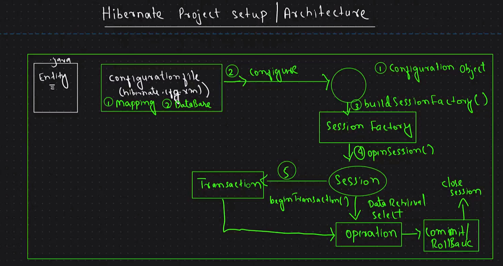

# Hibernate Learning

My notes while learning Hibernate.



# Hibernate Learning

A hands-on repository where I am learning **Hibernate ORM with Java** by
building small projects and experimenting with Hibernate features.

This repository will be updated as I learn and implement new concepts.

------------------------------------------------------------------------

## What is Hibernate?

Hibernate is an **ORM (Object-Relational Mapping) framework for Java**.

It allows Java classes and objects to be mapped with database tables,
making database operations easier to perform using Java objects.

------------------------------------------------------------------------

## Concepts Learned

### 1. Hibernate Configuration

Learned how to configure Hibernate using `hibernate.cfg.xml`.

The configuration contains details required for connecting Hibernate
with the database and setting up the Hibernate environment.

### 2. Configuration

Used Hibernate's `Configuration` class to load the Hibernate
configuration.

``` java
Configuration config = new Configuration();
config.configure();
```

### 3. SessionFactory

Learned how to create a `SessionFactory` from the Hibernate
configuration.

``` java
SessionFactory sessionFactory =
        config.buildSessionFactory();
```

A `SessionFactory` is used to create Hibernate `Session` objects.

### 4. Session

Learned how to create a Hibernate `Session`.

``` java
Session session = sessionFactory.openSession();
```

The `Session` is used to perform database operations using Hibernate.

### 5. Transaction

Learned how to start and manage a transaction.

``` java
Transaction transaction =
        session.beginTransaction();
```

After a successful operation:

``` java
transaction.commit();
```

If an error occurs:

``` java
transaction.rollback();
```

------------------------------------------------------------------------

## Entity Mapping

Learned how Java classes can be mapped to database tables using
Hibernate annotations.

### `@Entity`

Marks a Java class as a Hibernate entity.

``` java
@Entity
public class Student {
}
```

### `@Table`

Used to specify the database table name.

``` java
@Entity
@Table(name = "StudentsTable")
public class Student {
}
```

### `@Id`

Used to specify the primary key.

``` java
@Id
@Column(name = "SID")
private Integer sid;
```

### `@Column`

Used to map a Java field to a database column.

``` java
@Column(name = "SNAME")
private String sName;
```

### `@Transient`

Used for a field that should not be persisted in the database.

``` java
@Transient
private Integer eage;
```

------------------------------------------------------------------------

## Persisting an Entity

Learned how to persist an entity using `session.persist()`.

``` java
Student student = new Student();

student.setSid(1);
student.setsName("Varun");
student.setsCity("Mumbai");

session.persist(student);
```

------------------------------------------------------------------------

## Removing an Entity

Learned how to remove an entity using `session.remove()`.

``` java
Student st = new Student();

st.setSid(2);

session.remove(st);
```

------------------------------------------------------------------------

## Exception Handling

Used `try-catch-finally` to handle exceptions during Hibernate
operations and to commit or rollback transactions depending on whether
the operation succeeds.

------------------------------------------------------------------------

## Resource Management

Learned to close Hibernate resources after completing database
operations.

``` java
session.close();
sessionFactory.close();
```

------------------------------------------------------------------------

## Hibernate Flow

``` text
hibernate.cfg.xml
       ↓
Configuration
       ↓
SessionFactory
       ↓
Session
       ↓
Transaction
       ↓
Entity Operation
       ↓
Commit / Rollback
       ↓
Close Session
       ↓
Close SessionFactory
```

------------------------------------------------------------------------

## Projects

### FirstHibernateProject

My first Hibernate project where I learned the basic Hibernate setup,
entity mapping, and database operations.

**Concepts covered:**

-   Hibernate configuration
-   `Configuration`
-   `SessionFactory`
-   `Session`
-   `Transaction`
-   Entity mapping
-   `session.persist()`
-   `session.remove()`
-   Commit and rollback
-   Exception handling

### HibernateSelective

A practice project containing an `Employee` entity and Hibernate
persistence.

The entity uses annotations such as:

-   `@Entity`
-   `@Table`
-   `@Id`
-   `@Column`
-   `@Transient`

------------------------------------------------------------------------

## Technologies Used

-   **Java**
-   **Hibernate ORM**
-   **Maven**
-   **MySQL**

------------------------------------------------------------------------

## Learning Progress

-   [x] Hibernate setup with Maven
-   [x] MySQL database connection
-   [x] Hibernate configuration
-   [x] `Configuration`
-   [x] `SessionFactory`
-   [x] `Session`
-   [x] `Transaction`
-   [x] Entity mapping
-   [x] `@Entity`
-   [x] `@Table`
-   [x] `@Id`
-   [x] `@Column`
-   [x] `@Transient`
-   [x] `session.persist()`
-   [x] `session.remove()`
-   [x] Commit & rollback
-   [x] Exception handling
-   [x] Closing Hibernate resources

------------------------------------------------------------------------

## Purpose

This is a **learning repository** where I practice Hibernate concepts by
writing and experimenting with Java code.

I will continue adding new concepts as I learn them.

**Learning Hibernate step by step 🚀**
